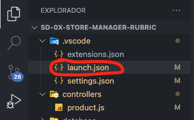
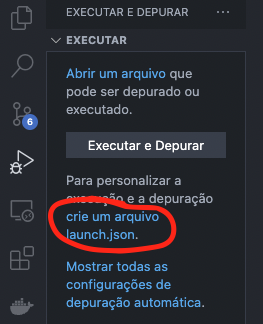
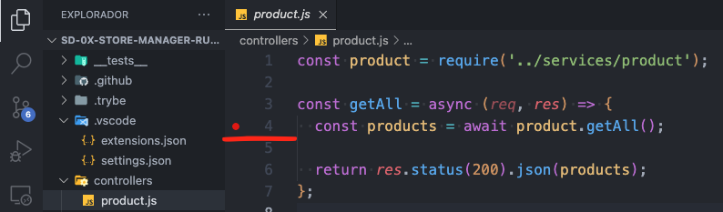
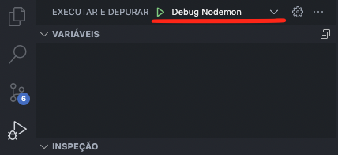
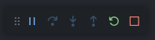
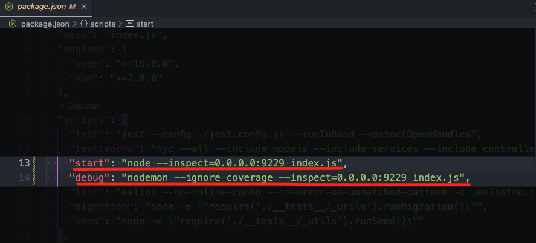

# Depurando Aplicações node no VSCODE

Primeiramente precisamos ver se no projeto já existe um arquivo chamado `launch.json` dentro da pasta `.vscode`.



Caso o arquivo exista vamos utilizar ele, se o arquivo não existe, vamos precisar criar o mesmo.

Para criar o arquivo basta ir em `Depuração` e ir na opção `crie um arquivo launch.json`, selecione a opção node.js e pronto seu arquivo será criado.



Agora vamos editar esse arquivo para configurar nossa depuração local ou usando o docker.

### Depuração Local

Para a depuração local basta adicionar o seguinte objeto dentro do array de configurations localizado no arquivo launch.json

```Javascript
{
  "name": "Debug Nodemon",
  "console": "integratedTerminal",
  "internalConsoleOptions": "neverOpen",
  "program": "${workspaceFolder}/",
  "request": "launch",
  "restart": true,
  "runtimeExecutable": "${workspaceFolder}/node_modules/.bin/nodemon",
  "skipFiles": [
    "<node_internals>/**"
  ],
  "type": "node"
}
```

Agora precisamos marcar em qual linha queremos que nosso depurador pare a execução do projeto, conforme a imagem abaixo.



Acesse no menu de depuração selecionar qual configuração irá ser executada, selecione a configuração que acabamos de criar chamada Debug Nodemon e clique no ícone de play que se encontra na leteral esquerda.



Pronto! Com isso sua aplicação vai estar online e com a depuração ligada, utilize o menu suspenso para navegar no seu código fonte. Lembre-se: Você precisa acessar sua rota em questão para que a depuração seja ativada.



### Depuração com Docker

Para a depuração com o docker vamos precisar adicionar o seguinte objeto dentro do array de configurations localizado no arquivo launch.json

```Javascript
{
  "name": "Debug com docker",
  "type": "node",
  "request": "attach",
  "restart": true,
  "port": 9229,
  "address": "localhost",
  "localRoot": "${workspaceFolder}/",
  "remoteRoot": "/home/node/app",
  "skipFiles": [
    "<node_internals>/**"
  ],
}
```

Vamos precisar fazer duas configurações no projeto:

A primeira configuração e acessar o compose e adicionar mais uma porta que vscode utilizará para a depuração, essa porta vamos utilizar a porta 9229:

```docker
...

ports:
  - 3000:3000
  - 9229:9229

...
```

A segunda configuração vamos precisar acessar o package.json e adicionar uma flag nos comandos relacionados a subir a aplicação, esse comando seria: `--inspect=0.0.0.0:9229`



Atenção dependendo do projeto o local desse comando pode variar, recomenda-se colocar no start ou debug, de preferência nós dois se assim estiver.

Com isso basta marcar em qual linha queremos que nosso depurador pare a execução do projeto, conforme a imagem abaixo.


Agora suba seu compose, acesse o container da sua aplicação, rode o comando para iniciar o servidor da sua aplicação, npm start ou npm run debug (vai depender da configuração do seu projeto).

Acesse no menu de depuração selecionar qual configuração irá ser executada, selecione a configuração que acabamos de criar chamada Debug com docker e clique no ícone de play que se encontra na lateral esquerda.


Pronto! Com isso sua aplicação vai estar online e com a depuração ligada, utilize o menu suspenso para navegar no seu código fonte. Lembre-se: Você precisa acessar sua rota em questão para que a depuração seja ativada.

